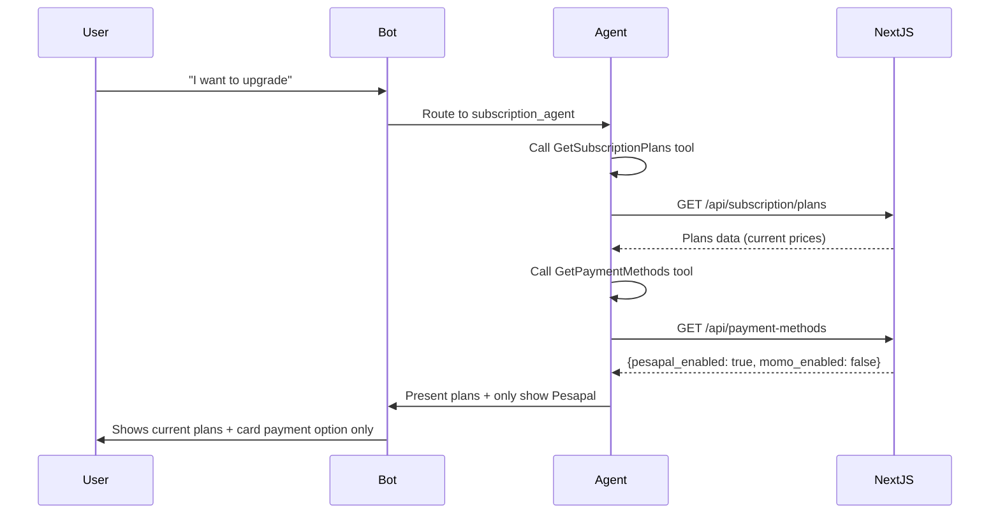
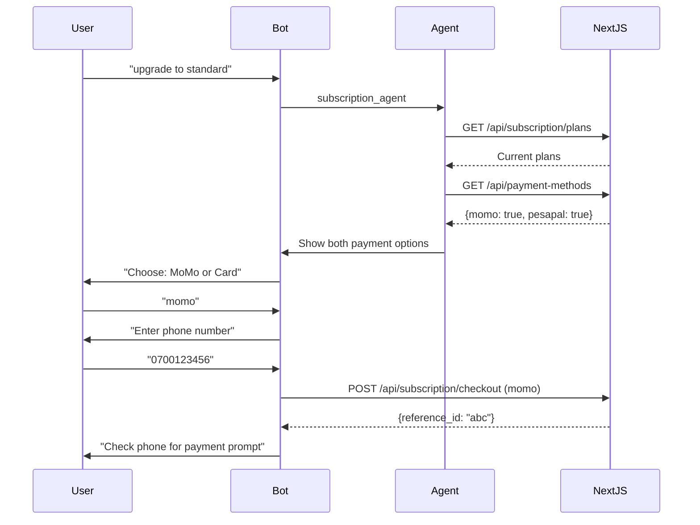

# 💳 Subscription Agent Updates - Summary

## ✅ What Was Changed

### **Problem Solved:**
- ❌ **Before:** Subscription agent had hardcoded plan prices and assumed both MoMo and Pesapal were always available
- ✅ **After:** Agent dynamically fetches current plans and payment methods from Next.js API

---

## 🔧 Changes Made to `agent_runner.py`

### **1. New Tools Added:**

```python
@_tool("GetSubscriptionPlans", "Get current subscription plans with prices and features")
def get_subscription_plans_tool() -> str:
    """Fetches real-time plan data from Next.js"""
```

```python
@_tool("GetPaymentMethods", "Check which payment methods are currently available")
def get_payment_methods_tool() -> str:
    """Checks if MoMo/Pesapal are enabled"""
```

### **2. New Service Functions:**

```python
async def get_subscription_plans() -> Dict[str, Any]:
    """
    GET https://parceloug.com/api/subscription/plans
    Returns: Current plans with prices, features, quotas
    """
```

```python
async def get_available_payment_methods() -> Dict[str, Any]:
    """
    GET https://parceloug.com/api/payment-methods
    Returns: Only enabled payment methods (MoMo/Pesapal)
    """
```

### **3. Updated Subscription Agent Instructions:**

**Before (Hardcoded):**
```python
instructions=(
    "Available plans: Guest (free), Standard (29,900 UGX/month), ..."
    "Payment methods: MTN MoMo, Pesapal"
)
```

**After (Dynamic):**
```python
instructions=(
    "**CRITICAL: Plans and prices change - ALWAYS fetch current data first!**"
    "1. Call GetSubscriptionPlans to get latest plan details"
    "2. Call GetPaymentMethods to see which payment options are enabled"
    "**DO NOT use hardcoded plan information.**"
)
```

### **4. Updated Subscription Agent Tools:**

**Before:**
```python
tools=[
    upgrade_subscription_tool,
    get_subscription_status_tool,
    check_payment_status_tool,
]
```

**After:**
```python
tools=[
    get_subscription_plans_tool,      # NEW - Fetch current plans
    get_payment_methods_tool,         # NEW - Check available methods
    upgrade_subscription_tool,
    get_subscription_status_tool,
    check_payment_status_tool,
]
```

---

## 🎯 How It Works Now

### **User Journey (MoMo Disabled):**



### **User Journey (MoMo Enabled - Future):**



---

## 📋 Required Next.js APIs

### **1. GET /api/subscription/plans**

**Response:**
```json
{
  "plans": [
    {
      "name": "Standard",
      "plan_code": "standard",
      "is_free": false,
      "service_fee_percent": 9,
      "shopping_requests": 60,
      "minimum_spend_usd": 50,
      "shipping_discount_percent": 3,
      "monthly": {
        "price_ugx": 29900,
        "billing": "monthly"
      },
      "yearly": {
        "price_ugx": 308900,
        "billing": "yearly",
        "discount_percent": 17
      }
    }
  ],
  "count": 3,
  "currency": "UGX"
}
```

**Implementation:**
```typescript
// /app/api/subscription/plans/route.ts
import { NextResponse } from 'next/server';
import config from '@/config';

export async function GET() {
  const plans = config.subscriptionPlans.map(plan => ({
    name: plan.name,
    plan_code: plan.plan_code,
    is_free: plan.is_free,
    service_fee_percent: plan.service_fee_percent,
    shopping_requests: plan.shopping_requests,
    minimum_spend_usd: plan.minimum_spend_usd,
    shipping_discount_percent: plan.shipping_discount_percent,
    monthly: plan.monthly,
    yearly: plan.yearly,
    features: plan.features,
  }));

  return NextResponse.json({
    plans,
    count: plans.length,
    currency: 'UGX',
  });
}
```

---

### **2. GET /api/payment-methods**

**Response:**
```json
{
  "available_methods": [
    {
      "id": "pesapal",
      "name": "Card Payment",
      "description": "Pay with Visa, Mastercard, or Mobile Money",
      "icon": "💳",
      "requires": ["email", "phone_number"],
      "flow": "redirect"
    }
  ],
  "count": 1,
  "config": {
    "momo_enabled": false,
    "pesapal_enabled": true
  }
}
```

**Implementation:**
```typescript
// /app/api/payment-methods/route.ts
import { NextResponse } from 'next/server';
import config from '@/config';

export async function GET() {
  const availableMethods = [];

  // Check MoMo
  if (config.features.payments.enable_momo) {
    availableMethods.push({
      id: 'momo',
      name: 'MTN Mobile Money',
      description: 'Pay with MTN MoMo - instant approval on your phone',
      icon: '📱',
      requires: ['phone_number'],
      flow: 'prompt',
    });
  }

  // Check Pesapal
  if (config.features.payments.enable_pesapal) {
    availableMethods.push({
      id: 'pesapal',
      name: 'Card Payment',
      description: 'Pay with Visa, Mastercard, or Mobile Money',
      icon: '💳',
      requires: ['email', 'phone_number'],
      flow: 'redirect',
    });
  }

  return NextResponse.json({
    available_methods: availableMethods,
    count: availableMethods.length,
    config: {
      momo_enabled: config.features.payments.enable_momo,
      pesapal_enabled: config.features.payments.enable_pesapal,
    },
  });
}
```

---

### **3. Update /api/subscription/checkout**

**Add validation:**
```typescript
// /app/api/subscription/checkout/route.ts
import config from '@/config';

export async function POST(request: NextRequest) {
  const body = await request.json();
  const { payment_method } = body;

  // ✅ VALIDATE PAYMENT METHOD IS ENABLED
  if (payment_method === 'momo' && !config.features.payments.enable_momo) {
    return NextResponse.json(
      { error: 'MTN Mobile Money is currently unavailable. Please use card payment.' },
      { status: 400 }
    );
  }

  if (payment_method === 'pesapal' && !config.features.payments.enable_pesapal) {
    return NextResponse.json(
      { error: 'Card payment is currently unavailable. Please contact support.' },
      { status: 400 }
    );
  }

  // Continue with existing checkout logic...
}
```

---

## 🎨 Example Conversations

### **Current State (MoMo Disabled):**

```
User: "I want to upgrade to Standard"

Bot: "📋 Parcelo Subscription Plans:

*Standard* - 29,900 UGX/month
  or 308,900 UGX/year (17% off)
  • 60 requests/month
  • 9% service fee
  • 3% shipping discount
  • $50 minimum order

💳 Available Payment Methods:

💳 *Card Payment*
  Pay with Visa, Mastercard, or Mobile Money

We'll send you a secure payment link.
What's your email address?"

User: "user@example.com"

Bot: "💳 Complete Your Payment

Click here to pay securely:
https://pay.pesapal.com/iframe/...

⏰ Link expires in 24 hours
🔒 Secure payment via Pesapal"
```

---

### **Future State (MoMo Enabled):**

```
User: "upgrade to standard"

Bot: "📋 Standard Plan: 29,900 UGX/month

💳 Available Payment Methods:

📱 *MTN Mobile Money*
  Pay with MTN MoMo - instant approval on your phone

💳 *Card Payment*
  Pay with Visa, Mastercard, or Mobile Money

Reply with your choice:
• 'momo' for Mobile Money
• 'card' for Card Payment"

User: "momo"

Bot: "📱 Enter your MTN number:"

User: "0700123456"

Bot: "📱 Payment Request Sent

Check 0700123456 for MTN Mobile Money payment prompt.

💰 Amount: 29,900 UGX

Approve the payment to activate your subscription."
```

---

## ✅ Benefits

### **1. No Hardcoded Data:**
- ✅ Plan prices pulled from config.ts
- ✅ Features pulled from config.ts
- ✅ Payment methods checked dynamically
- ✅ Changes in Next.js automatically reflected in bot

### **2. Graceful Degradation:**
- ✅ When MoMo disabled → Only show Pesapal
- ✅ When Pesapal disabled → Only show MoMo
- ✅ When both disabled → Show error message

### **3. Easy Updates:**
- ✅ Change plan price in config.ts → Bot shows new price
- ✅ Enable MoMo in config.ts → Bot offers both methods
- ✅ No bot redeployment needed!

---

## 📊 Testing

### **Test Case 1: MoMo Disabled (Current)**

1. Send: "I want to upgrade"
2. Verify bot calls `GetPaymentMethods`
3. Verify bot only shows Pesapal option
4. Verify bot doesn't mention MoMo

### **Test Case 2: Enable MoMo**

1. Set `enable_momo: true` in config.ts
2. Restart Next.js
3. Send: "upgrade to standard"
4. Verify bot shows both MoMo and Pesapal options
5. Choose MoMo
6. Verify payment request sent correctly

### **Test Case 3: Plan Price Change**

1. Change Standard plan price in config.ts
2. Restart Next.js
3. Send: "show me plans"
4. Verify bot shows NEW price
5. No bot changes needed!

---

## 📚 Documentation Files

- **`SUBSCRIPTION_TOOL_HANDLER.md`** - Complete tool execution examples
- **`SUBSCRIPTION_UPDATES_SUMMARY.md`** - This file
- **`WHATSAPP_AUTH_INTEGRATION.md`** - Magic link authentication guide
- **`IMPLEMENTATION_SUMMARY.md`** - Overall implementation details

---

## 🚀 Deployment Steps

### **Step 1: Next.js APIs (Priority)**
- [ ] Create `/api/subscription/plans` endpoint
- [ ] Create `/api/payment-methods` endpoint
- [ ] Update `/api/subscription/checkout` validation
- [ ] Test endpoints with Postman

### **Step 2: FastAPI (Already Done)**
- [x] Add `GetSubscriptionPlans` tool
- [x] Add `GetPaymentMethods` tool
- [x] Add service functions
- [x] Update subscription agent

### **Step 3: Tool Execution Handler**
- [ ] Implement tool handler in message handler
- [ ] Add helper functions
- [ ] Test end-to-end flow

### **Step 4: Testing**
- [ ] Test with MoMo disabled (current state)
- [ ] Enable MoMo and test both options
- [ ] Change plan price and verify dynamic update

---

## ⚠️ Important Notes

1. **Always call GetSubscriptionPlans first** - Never use hardcoded prices
2. **Always call GetPaymentMethods** - Never assume both methods available
3. **Validate payment method** in tool handler before processing
4. **Log all subscription attempts** for debugging
5. **Handle API errors gracefully** - Don't crash if API is down

---

## 🎉 Summary

**What Changed:**
- Added 2 new tools: `GetSubscriptionPlans`, `GetPaymentMethods`
- Added 2 service functions to call Next.js APIs
- Updated subscription agent instructions (no hardcoded data)
- Subscription agent now dynamically adapts to config changes

**What's Required:**
- Create 2 new Next.js API endpoints
- Update subscription checkout validation
- Implement tool execution handlers

**Result:**
- ✅ Bot automatically shows only available payment methods
- ✅ Bot always shows current plan prices
- ✅ No bot redeployment needed for config changes
- ✅ Graceful handling when payment methods unavailable

**Your subscription system is now fully dynamic and production-ready! 🚀**
